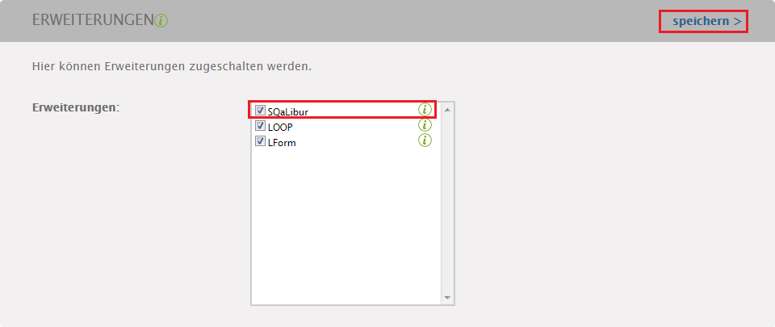
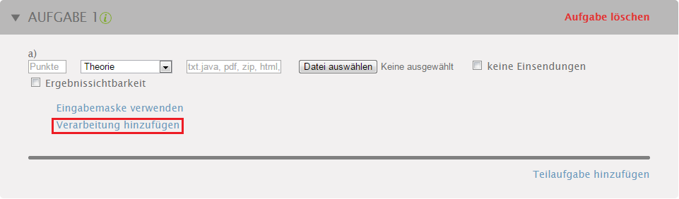
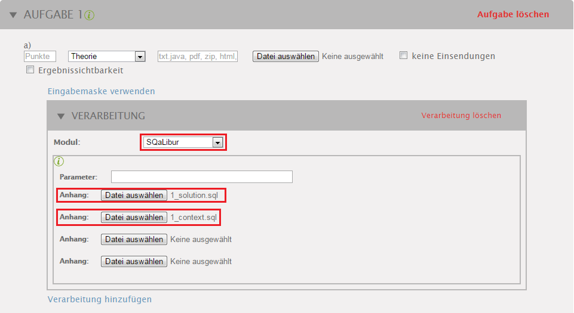

# SQaLibur-Core

SQaLibur ist ein Java-Webservice zur automatischen Vorkorrektur von studentischen SQL-Einsendungen. Dabei dient die Übungsplattform OSTEPU (https://github.com/ostepu/ostepu-core) als Oberfläche, sodass SQaLibur dort nur als sogenannte ``Verarbeitung`` zu einer Veranstaltung hinzu installiert wird und anschließend durch Übungsleiter für eine Aufgabestellung ausgewählt werden kann. Dabei werden die Einsendungen der Studenten vor dem Speichern zunächst durch SQaLibur betrachtet und versucht die Äquivalenz der Einsendung mit einer Musterlösung nachweisen zu können, um dann im Falle einer inhaltlichen Übereinstimmung bereits die volle Punktzahl zu vergeben.

Zur Prüfung der Äquivalenz setzt SQaLibur auf die Normalisierung von Einsendung und Musterlösung, sodass versucht wird, beide Anfrage syntaktisch gleich zu bekommen und damit die Äquivalenz beider Anfragen zeigen zu können. Dieser Ansatz steckt hierbei jedoch noch in den Kinderschuhen, sodass die Erfolgsrate eher gering ist, jedoch noch ausgebaut werden kann.

Die Regeln zur Normalisierung von Einsendung und Musterlösung können als XSLT-Regeln formuliert werden, wie in https://github.com/tilluhlig/sqalibur-xsltRules, oder direkt in Java auf einem DOM-Objekt programmiert werden. Die Regelverwaltung und den XSLT-Prozessor stellt https://github.com/tilluhlig/sqalibur-treeNormalizer bereit. Zudem wird der SQL-Parser/Deparser aus https://github.com/tilluhlig/JSqlParser verwendet, um die eingehenden Anfragen zu handhaben.

## Die Anbindung von SQaLibur an eine Veranstaltung

Der neue Bestandteil SQaLibur soll das Erstellen einer Übungsserie erweitern und dabei speziell für eine Veranstaltung installiert werden. Dabei nutzt es den gleichen Ansatz wie das bekannte LOOP von OSTEPU, wobei es als Erweiterung einer Veranstaltung hinzugefügt werden kann 

*A: die SQaLibur Erweiterung installieren*

Wie in Abbildung A zu sehen, muss SQaLibur ausgewählt und über die Schaltfläche ``speichern`` entsprechend installiert werden. Dabei legt SQaLibur einen neuen Eintrag in der Datenbank an, durch welchen es als verarbeitendes Modul beim Erstellen von Übungsserien gewählt werden kann. Damit ist es SQaLibur möglich, auf das Einsenden eines Studenten zu reagieren und Bewertungen der Einsendungen beim Hochladen vorzunehmen.

## Die Erstellung einer Übungsserie

Damit SQaLibur in einer Übungsserie verwendet wird, muss es als Verarbeitung für jede Aufgabe gewählt werden, in der es Wirken soll.
Darüber hinaus erfolgt die Erstellung einer Übungsserie und Aufgabe wie bisher.

*B: SQaLibur als Verarbeitung wählen*

Dazu wird also entsprechend Abbildung B ausgewählt, dass man eine Verarbeitung verwenden möchte.

*C: SQaLibur als Verarbeitung konfigurieren*

Nun muss wie in Abbildung C das Modul SQaLibur gewählt werden, sodass sich der Konfigurationsbereich des Moduls öffnet. Hier können wir nun jeweils eine SQL-Datei als Musterlösung und für den Kontext hochladen. Dabei ist es unwichtig in welcher Reihenfolge die geschieht, denn die Zuordnung erfolgt anhand der enthaltenen SQL-Elemente. Wenn er also eine Create-Table Anweisung erkennt, so wird er diese Datei als Kontext betrachten. Wenn er eine andere Art von Anfragen in der jeweiligen Datei findet oder nur eine einzelne Datei eingereicht wird, so wir er diese als Musterlösung interpretieren.

Wenn die Übungsserie nun in dieser Form angelegt wird, können die Studenten ihre Einsendungen hochladen, welche dann durch OSTEPU während des Einsendevorgangs zunächst von SQaLibur bearbeitet werden.

## Die Verwendung von SQaLibur durch Studenten
TODO TODO TODO
